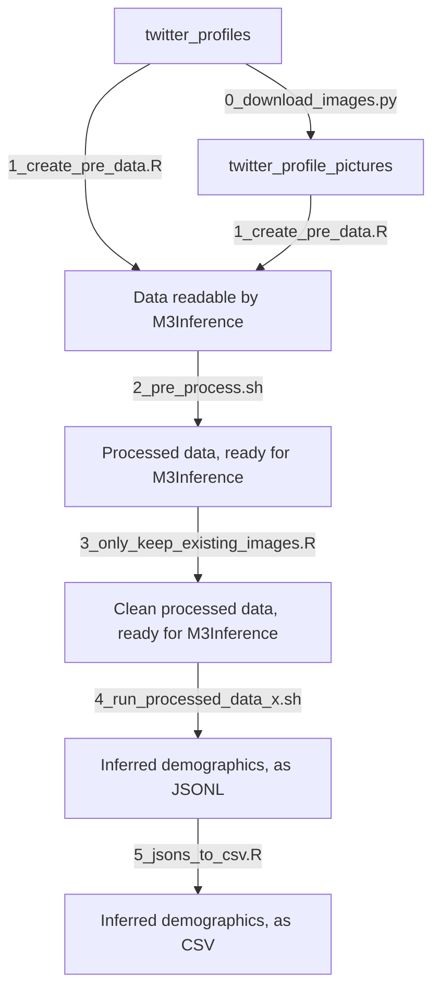

# `soederstroem_et_al_2026`

These are some calculations as part of `[Söderström et al., 2026]`.

## Goal

The goal of this code is to estimate some characteristics from
three list of Twitter/X profiles.
The list of Twitter/X profiles has been provided by the others.
The characteristics inferred from a Twitter/X profile are
the age, gender and whether it is a person or organization.
This inference is done with and without a profile image.

## Overview of steps

Here I give an overview of input, output and intermediate scripts.
The intermediate scripts are described in the detailed overview.

## Installation

Installing the Python package `m3inference` from the Fork by `jieliliu`
at [`https://github.com/jieliliu/m3inference`](https://github.com/jieliliu/m3inference)
can be done as such:

```bash
pip install git+https://github.com/jieliliu/m3inference.git --break-system-packages
```


### Input files

Input file                                        |Description
--------------------------------------------------|----------------------------
[data/stop_the_steal.csv](data/stop_the_steal.csv)|'Stop the Steal' profiles
[data/swexit.csv](data/swexit.csv)                |'Swexit' profiles
[data/yttrandefrihet.csv](data/yttrandefrihet.csv)|'Yttrandefrihet' profiles

### Pipeline



Script name                                                                                           |Description
------------------------------------------------------------------------------------------------------|--------------------------------------------------------------------------
[0_download_images.py](0_download_images.py)                                                          |Downloads the profile image of the Twitter/X profile
[1_create_pre_data.R](1_create_pre_data.R)                                                            |Create M3Inference pre data
[2_pre_process.sh](2_pre_process.sh)                                                                  |Let M3Inference pre-process that data
[3_only_keep_existing_images.R](3_only_keep_existing_images.R)                                        |Filter M3Inference-ready data for profile images to exist
[4_run_processed_data_stop_the_steal.py](4_run_processed_data_stop_the_steal.py                       |Run M3Inference for 'Stop the Steal' profiles, uses images when possible
[4_run_processed_data_stop_the_steal.sh](4_run_processed_data_stop_the_steal.sh)                      |Run M3Inference for 'Stop the Steal' profiles, uses images when possible
[4_run_processed_data_stop_the_steal_text_based.py](4_run_processed_data_stop_the_steal_text_based.py)|Run M3Inference for 'Stop the Steal' profiles, only uses the profile text
[4_run_processed_data_stop_the_steal_text_based.sh](4_run_processed_data_stop_the_steal_text_based.sh)|Run M3Inference for 'Stop the Steal' profiles, only uses the profile text
[4_run_processed_data_swexit.py](4_run_processed_data_swexit.py)                                      |Run M3Inference for 'Swexit' profiles, uses images when possible
[4_run_processed_data_swexit.sh](4_run_processed_data_swexit.sh)                                      |Run M3Inference for 'Swexit' profiles, uses images when possible
[4_run_processed_data_swexit_text_based.py](4_run_processed_data_swexit_text_based.py)                |Run M3Inference for 'Swexit' profiles, only uses the profile text
[4_run_processed_data_swexit_text_based.sh](4_run_processed_data_swexit_text_based.sh)                |Run M3Inference for 'Swexit' profiles, only uses the profile text
[4_run_processed_data_yttrandefrihet.py](4_run_processed_data_yttrandefrihet.py)                      |Run M3Inference for 'Yttrandefrihet' profiles, uses images when possible
[4_run_processed_data_yttrandefrihet.sh](4_run_processed_data_yttrandefrihet.sh)                      |Run M3Inference for 'Yttrandefrihet' profiles, uses images when possible
[4_run_processed_data_yttrandefrihet_text_based.py](4_run_processed_data_yttrandefrihet_text_based.py)|Run M3Inference for 'Yttrandefrihet' profiles, only uses the profile text
[4_run_processed_data_yttrandefrihet_text_based.sh](4_run_processed_data_yttrandefrihet_text_based.sh)|Run M3Inference for 'Yttrandefrihet' profiles, only uses the profile text
[5_jsons_to_csv.R](5_jsons_to_csv.R)                                                                  |Convert the M3Inference output to a comma-seperated file

### Step 0

Script name                                                                                           |Description
------------------------------------------------------------------------------------------------------|--------------------------------------------------------------------------
[0_download_images.py](0_download_images.py)                                                          |Downloads the profile image of the Twitter/X profile

This script download the profile images using the Twitter/X API.

Alongside this, I used 
[sinugrepo's x_profile_downloader GitHub repository](https://github.com/sinugrepo/x_profile_downloader)
to download 50 profile images per 4 hours,
as it is easy to use.

### Step 1

Script name                                                                                           |Description
------------------------------------------------------------------------------------------------------|--------------------------------------------------------------------------
[1_create_pre_data.R](1_create_pre_data.R)                                                            |Create M3Inference pre data

This script converts the 3 input files to 6 intermediate files.
Per input file, it creates one intermediate file containing all profiles
and one intermediate file for profiles that have an image.

Besides that, this script does some cleaning:

- Remove emojis: M3Inference cannot process this
- Remove quotes: M3Inference cannot process this
- Remove newlines: M3Inference cannot process this
- If the language is not English (it is often Swedish),
  set it to unknown,
  as M3Inference cannot process Swedish

Filename                                          |Lines|Entries |Profiles with pictures|Profiles with pictures/line
--------------------------------------------------|-----|--------|----------------------|---------------------------
[data/yttrandefrihet.csv](data/yttrandefrihet.csv)|453  |311     |69                    |15%
[data/swexit.csv](data/swexit.csv)                |1005 |644     |88                    |9%
[data/stop_the_steal.csv](data/stop_the_steal.csv)|22003|14560   |3664                  |17%

- Lines: the number of lines the file has
- Entries: the number of entries the file has. Because users are allowed to
  have newlines (`\n`) in their profiles, one entry can span multiple lines
  in a file
- Profiles: the number of profiles with an image
- Profiles/line: the number of profiles with an image per line of file

<!-- Output:

```
richel@richel-latitude-7430:~/GitHubs/twitter_inference$ ./1_create_pre_data.R 
csv_file_name: data/yttrandefrihet.csv (453 lines)
jsonl_file_name: intermediate/yttrandefrihet.jsonl (69 lines)
csv_file_name: data/yttrandefrihet.csv (453 lines)
jsonl_file_name: intermediate/yttrandefrihet_text_based.jsonl (311 lines)
csv_file_name: data/swexit.csv (1005 lines)
jsonl_file_name: intermediate/swexit.jsonl (88 lines)
csv_file_name: data/swexit.csv (1005 lines)
jsonl_file_name: intermediate/swexit_text_based.jsonl (644 lines)
csv_file_name: data/stop_the_steal.csv (22003 lines)
jsonl_file_name: intermediate/stop_the_steal.jsonl (3664 lines)
csv_file_name: data/stop_the_steal.csv (22003 lines)
jsonl_file_name: intermediate/stop_the_steal_text_based.jsonl (14560 lines)
```
-->

These are timings of how long this step takes:

Filename                                          |Lines|User time|Time per line
--------------------------------------------------|-----|---------|-------------
[data/yttrandefrihet.csv](data/yttrandefrihet.csv)|453  |17.879s  |0.04 s/line
[data/swexit.csv](data/swexit.csv)                |1005 |29.724s  |0.03 s/line
[data/stop_the_steal.csv](data/stop_the_steal.csv)|22003|7m12.203s|0.02 s/line


### Step 2

Script name                                                                                           |Description
------------------------------------------------------------------------------------------------------|--------------------------------------------------------------------------
[2_pre_process.sh](2_pre_process.sh)                                                                  |Let M3Inference pre-process that data

### Step 3

Script name                                                                                           |Description
------------------------------------------------------------------------------------------------------|--------------------------------------------------------------------------
[3_only_keep_existing_images.R](3_only_keep_existing_images.R)                                        |Filter M3Inference-ready data for profile images to exist

This script filters for profiles that once existed and once had a
profile image (i.e. those in the original data set)
for still existing and still having a profile image

Filename                                          |Profiles|Full profiles|Full profile/profile
--------------------------------------------------|--------|-------------|-------------
[data/yttrandefrihet.csv](data/yttrandefrihet.csv)|69      |16           |23%
[data/swexit.csv](data/swexit.csv)                |88      |16           |18%
[data/stop_the_steal.csv](data/stop_the_steal.csv)|3664    |22           |0.6%

- Profiles: the number of profiles that once existed and once had a profile
  image
- Full profiles: the number of profiles that still exist and still have
  a profile image

### Step 4

Script name                                                                                           |Description
------------------------------------------------------------------------------------------------------|--------------------------------------------------------------------------
[4_run_processed_data_stop_the_steal.py](4_run_processed_data_stop_the_steal.py                       |Run M3Inference for 'Stop the Steal' profiles, uses images when possible
[4_run_processed_data_stop_the_steal.sh](4_run_processed_data_stop_the_steal.sh)                      |Run M3Inference for 'Stop the Steal' profiles, uses images when possible
[4_run_processed_data_stop_the_steal_text_based.py](4_run_processed_data_stop_the_steal_text_based.py)|Run M3Inference for 'Stop the Steal' profiles, only uses the profile text
[4_run_processed_data_stop_the_steal_text_based.sh](4_run_processed_data_stop_the_steal_text_based.sh)|Run M3Inference for 'Stop the Steal' profiles, only uses the profile text
[4_run_processed_data_swexit.py](4_run_processed_data_swexit.py)                                      |Run M3Inference for 'Swexit' profiles, uses images when possible
[4_run_processed_data_swexit.sh](4_run_processed_data_swexit.sh)                                      |Run M3Inference for 'Swexit' profiles, uses images when possible
[4_run_processed_data_swexit_text_based.py](4_run_processed_data_swexit_text_based.py)                |Run M3Inference for 'Swexit' profiles, only uses the profile text
[4_run_processed_data_swexit_text_based.sh](4_run_processed_data_swexit_text_based.sh)                |Run M3Inference for 'Swexit' profiles, only uses the profile text
[4_run_processed_data_yttrandefrihet.py](4_run_processed_data_yttrandefrihet.py)                      |Run M3Inference for 'Yttrandefrihet' profiles, uses images when possible
[4_run_processed_data_yttrandefrihet.sh](4_run_processed_data_yttrandefrihet.sh)                      |Run M3Inference for 'Yttrandefrihet' profiles, uses images when possible
[4_run_processed_data_yttrandefrihet_text_based.py](4_run_processed_data_yttrandefrihet_text_based.py)|Run M3Inference for 'Yttrandefrihet' profiles, only uses the profile text
[4_run_processed_data_yttrandefrihet_text_based.sh](4_run_processed_data_yttrandefrihet_text_based.sh)|Run M3Inference for 'Yttrandefrihet' profiles, only uses the profile text

Here are some timings:

Script                                                                                                |Time
------------------------------------------------------------------------------------------------------|--------------------------------------------
[4_run_processed_data_yttrandefrihet_text_based.sh](4_run_processed_data_yttrandefrihet_text_based.sh)|real 1m59.452s, user 0m21.547s, sys 0m2.279s
[4_run_processed_data_swexit_text_based.sh](4_run_processed_data_swexit_text_based.sh)                |real 0m6.713s, user 0m55.083s, sys 0m1.932s

<!-- 

``` 
richel@richel-latitude-7430:~/GitHubs/twitter_inference$ time ./4_run_processed_data_yttrandefrihet_text_based.sh
...
xt_model.mdl
03/30/2026 21:21:41 - INFO - m3inference.dataset -   311 data entries loaded.
Predicting...:   0%|                                                 | 0/20 [00:00<?, ?it/s]/home/richel/.local/lib/python3.12/site-packages/torch/utils/data/dataloader.py:1118: UserWarning: 'pin_memory' argument is set as true but no accelerator is found, then device pinned memory won't be used.
  super().__init__(loader)
Predicting...: 100%|████████████████████████████████████████| 20/20 [00:01<00:00, 13.00it/s]
03/30/2026 21:21:42 - WARNING - m3inference.m3inference -   ID 1158478976 already exists. Please double-check the input data. Skipping for now...

real	1m59.452s
user	0m21.547s
sys	0m2.279s
```

```
richel@richel-latitude-7430:~/GitHubs/twitter_inference$ time ./4_run_processed_data_swexit_text_based.sh 
03/30/2026 21:25:38 - INFO - m3inference.m3inference -   Version 1.1.5
03/30/2026 21:25:38 - INFO - m3inference.m3inference -   Running on cpu.
03/30/2026 21:25:38 - INFO - m3inference.m3inference -   Will use text model. Note that as M3 was optimized to work well with both image and text data,                                     it is not recommended to use text only model unless you do not have the profile image.
03/30/2026 21:25:38 - INFO - m3inference.m3inference -   Model text_model exists at /home/richel/m3/models/text_model.mdl.
03/30/2026 21:25:38 - INFO - m3inference.utils -   Checking MD5 for model text_model at /home/richel/m3/models/text_model.mdl
03/30/2026 21:25:38 - INFO - m3inference.utils -   MD5s match.
03/30/2026 21:25:38 - INFO - m3inference.m3inference -   Loaded pretrained weight at /home/richel/m3/models/text_model.mdl
03/30/2026 21:25:38 - INFO - m3inference.dataset -   644 data entries loaded.
Predicting...:   0%|                                                 | 0/41 [00:00<?, ?it/s]/home/richel/.local/lib/python3.12/site-packages/torch/utils/data/dataloader.py:1118: UserWarning: 'pin_memory' argument is set as true but no accelerator is found, then device pinned memory won't be used.
  super().__init__(loader)
Predicting...: 100%|████████████████████████████████████████| 41/41 [00:04<00:00,  9.24it/s]
03/30/2026 21:25:43 - WARNING - m3inference.m3inference -   ID 939763274823987200 already exists. Please double-check the input data. Skipping for now...
03/30/2026 21:25:43 - WARNING - m3inference.m3inference -   ID 939763274823987200 already exists. Please double-check the input data. Skipping for now...
03/30/2026 21:25:43 - WARNING - m3inference.m3inference -   ID 190195939 already exists. Please double-check the input data. Skipping for now...
03/30/2026 21:25:43 - WARNING - m3inference.m3inference -   ID 190195939 already exists. Please double-check the input data. Skipping for now...
03/30/2026 21:25:43 - WARNING - m3inference.m3inference -   ID 49568716 already exists. Please double-check the input data. Skipping for now...

real	0m6.713s
user	0m55.083s
sys	0m1.932s
```

-->

### Step 5

Script name                                                                                           |Description
------------------------------------------------------------------------------------------------------|--------------------------------------------------------------------------
[5_jsons_to_csv.R](5_jsons_to_csv.R)                                                                  |Convert the M3Inference output to a comma-seperated file


### Output files

Output file                                                                   |Description
------------------------------------------------------------------------------|----------------------------
[results_stop_the_steal.csv](results_stop_the_steal.csv)                      |Inferred demographics for the 'Stop the Steal' profiles, used images when possible
[results_stop_the_steal_text_based.csv](results_stop_the_steal_text_based.csv)|Inferred demographics for the 'Stop the Steal' profiles, only used the profile text
[results_swexit.csv](results_swexit.csv)                                      |Inferred demographics for the 'Swexit' profiles, used images when possible
[results_swexit_text_based.csv](results_swexit_text_based.csv)                |Inferred demographics for the 'Swexit' profiles, only used the profile text
[results_yttrandefrihet.csv](results_yttrandefrihet.csv)                      |Inferred demographics for the 'Yttrandefrihet' profiles, used images when possible
[results_yttrandefrihet_text_based.csv](results_yttrandefrihet_text_based.csv)|Inferred demographics for the 'Yttrandefrihet, only used the profile text

## Download test data

The testdata can be downloaded from 
[`https://github.com/euagendas/m3inference`](https://github.com/euagendas/m3inference).
The file can be viewed [here](https://github.com/euagendas/m3inference/blob/master/test/data.jsonl).

```
wget https://raw.githubusercontent.com/euagendas/m3inference/refs/heads/master/test/data.jsonl
```


## Running

```
./run.sh
```

## Error

```
richel@richel-latitude-7430:~/GitHubs/twitter_inference$ ./3_run_processed_data.py 
03/23/2026 21:17:08 - INFO - m3inference.m3inference -   Version 1.1.5
03/23/2026 21:17:08 - INFO - m3inference.m3inference -   Running on cpu.
03/23/2026 21:17:08 - INFO - m3inference.m3inference -   Will use full M3 model.
03/23/2026 21:17:08 - INFO - m3inference.m3inference -   Model full_model exists at /home/richel/m3/models/full_model.mdl.
03/23/2026 21:17:08 - INFO - m3inference.utils -   Checking MD5 for model full_model at /home/richel/m3/models/full_model.mdl
03/23/2026 21:17:08 - INFO - m3inference.utils -   MD5s match.
03/23/2026 21:17:08 - INFO - m3inference.m3inference -   Loaded pretrained weight at /home/richel/m3/models/full_model.mdl
03/23/2026 21:17:08 - INFO - m3inference.dataset -   50 data entries loaded.
Predicting...:   0%|                                                  | 0/4 [00:00<?, ?it/s]/home/richel/.local/lib/python3.12/site-packages/torch/utils/data/dataloader.py:1118: UserWarning: 'pin_memory' argument is set as true but no accelerator is found, then device pinned memory won't be used.
  super().__init__(loader)
Predicting...:  25%|██████████▌                               | 1/4 [00:01<00:03,  1.33s/it]
Traceback (most recent call last):
  File "/home/richel/GitHubs/twitter_inference/./3_run_processed_data.py", line 6, in <module>
    pred = m3.infer('./intermediate/data_resized.jsonl')
           ^^^^^^^^^^^^^^^^^^^^^^^^^^^^^^^^^^^^^^^^^^^^^
  File "/home/richel/.local/lib/python3.12/site-packages/m3inference/m3inference.py", line 130, in infer
    for batch in tqdm(dataloader, desc='Predicting...', disable=logging.root.level>=logging.WARN):
  File "/home/richel/.local/lib/python3.12/site-packages/tqdm/std.py", line 1181, in __iter__
    for obj in iterable:
  File "/home/richel/.local/lib/python3.12/site-packages/torch/utils/data/dataloader.py", line 741, in __next__
    data = self._next_data()
           ^^^^^^^^^^^^^^^^^
  File "/home/richel/.local/lib/python3.12/site-packages/torch/utils/data/dataloader.py", line 1518, in _next_data
    return self._process_data(data, worker_id)
           ^^^^^^^^^^^^^^^^^^^^^^^^^^^^^^^^^^^
  File "/home/richel/.local/lib/python3.12/site-packages/torch/utils/data/dataloader.py", line 1586, in _process_data
    data.reraise()
  File "/home/richel/.local/lib/python3.12/site-packages/torch/_utils.py", line 775, in reraise
    raise exception
RuntimeError: Caught RuntimeError in DataLoader worker process 1.
Original Traceback (most recent call last):
  File "/home/richel/.local/lib/python3.12/site-packages/torch/utils/data/_utils/worker.py", line 358, in _worker_loop
    data = fetcher.fetch(index)  # type: ignore[possibly-undefined]
           ^^^^^^^^^^^^^^^^^^^^
  File "/home/richel/.local/lib/python3.12/site-packages/torch/utils/data/_utils/fetch.py", line 57, in fetch
    return self.collate_fn(data)
           ^^^^^^^^^^^^^^^^^^^^^
  File "/home/richel/.local/lib/python3.12/site-packages/torch/utils/data/_utils/collate.py", line 401, in default_collate
    return collate(batch, collate_fn_map=default_collate_fn_map)
           ^^^^^^^^^^^^^^^^^^^^^^^^^^^^^^^^^^^^^^^^^^^^^^^^^^^^^
  File "/home/richel/.local/lib/python3.12/site-packages/torch/utils/data/_utils/collate.py", line 215, in collate
    collate(samples, collate_fn_map=collate_fn_map)
  File "/home/richel/.local/lib/python3.12/site-packages/torch/utils/data/_utils/collate.py", line 155, in collate
    return collate_fn_map[elem_type](batch, collate_fn_map=collate_fn_map)
           ^^^^^^^^^^^^^^^^^^^^^^^^^^^^^^^^^^^^^^^^^^^^^^^^^^^^^^^^^^^^^^^
  File "/home/richel/.local/lib/python3.12/site-packages/torch/utils/data/_utils/collate.py", line 274, in collate_tensor_fn
    out = elem.new(storage).resize_(len(batch), *list(elem.size()))
          ^^^^^^^^^^^^^^^^^^^^^^^^^^^^^^^^^^^^^^^^^^^^^^^^^^^^^^^^^
RuntimeError: Trying to resize storage that is not resizable
```

## FAQ

### Why not use `pip` to install `m3inference`?

Because then you will get the error shown below:

```
Traceback (most recent call last):
  File "/home/richel/GitHubs/twitter_inference/./run.py", line 15, in <module>
    from m3inference import M3Inference
  File "/home/richel/.local/lib/python3.12/site-packages/m3inference/__init__.py", line 1, in <module>
    from .m3inference import M3Inference
  File "/home/richel/.local/lib/python3.12/site-packages/m3inference/m3inference.py", line 14, in <module>
    from .full_model import M3InferenceModel
  File "/home/richel/.local/lib/python3.12/site-packages/m3inference/full_model.py", line 11, in <module>
    class M3InferenceModel(nn.Module):
  File "/home/richel/.local/lib/python3.12/site-packages/m3inference/full_model.py", line 12, in M3InferenceModel
    def __init__(self, device='cuda' if torch.cuda.is_available() else 'cpu'):
                                        ^^^^^
NameError: name 'torch' is not defined
```

Hence, do **not** use the command below to install `m3inference`.

```
pip install m3inference --break-system-packages
```

## Why not install from `https://github.com/euagendas/m3inference`?

Because this gives the following error:

```
richel@richel-latitude-7430:~/GitHubs/twitter_inference$ python3 run.py 
Traceback (most recent call last):
  File "/home/richel/GitHubs/twitter_inference/run.py", line 5, in <module>
    m3 = M3Inference()
         ^^^^^^^^^^^^^
  File "/home/richel/.local/lib/python3.12/site-packages/m3inference/m3inference.py", line 43, in __init__
    set_seed(seed)
  File "/home/richel/.local/lib/python3.12/site-packages/m3inference/utils.py", line 39, in set_seed
    torch.manual_seed(seed)
    ^^^^^
NameError: name 'torch' is not defined
```

Installing the Python package `m3inference` from its homepage at
[`https://github.com/euagendas/m3inference`](https://github.com/euagendas/m3inference)
can be done as such:

```bash
# Fails
pip install git+https://github.com/euagendas/m3inference.git --break-system-packages
```

The install gives the correct last commit hash:

```
richel@richel-latitude-7430:~/GitHubs/twitter_inference$ pip install git+https://github.com/euagendas/m3inference.git --break-system-packages
Defaulting to user installation because normal site-packages is not writeable
WARNING: Skipping /usr/lib/python3.12/dist-packages/protontricks-1.10.5.dist-info due to invalid metadata entry 'name'
Collecting git+https://github.com/euagendas/m3inference.git
  Cloning https://github.com/euagendas/m3inference.git to /tmp/pip-req-build-irzwz5eb
  Running command git clone --filter=blob:none --quiet https://github.com/euagendas/m3inference.git /tmp/pip-req-build-irzwz5eb
  Resolved https://github.com/euagendas/m3inference.git to commit 57953b4bb0bed34ce184253e25b327287b43d5e5
  Preparing metadata (setup.py) ... done
```

However, the code `run.py` will not work.


## Troubleshooting

### `json.decoder.JSONDecodeError: Expecting ',' delimiter`

```
json.decoder.JSONDecodeError: Expecting ',' delimiter: line 1 column 40 (char 39)

real	0m2.206s
user	0m2.489s
sys	0m1.617s
richel@richel-latitude-7430:~/GitHubs/twitter_inference$ cat temp_stop_the_steal.jsonl | head -n 2179 | tail -n 1 > intermediate/stop_the_steal.jsonl
```

```
richel@richel-latitude-7430:~/GitHubs/twitter_inference$ cat temp_stop_the_steal.jsonl | head -n 2179 | tail -n 1 
{"id": "237829375", "name": "Pasquale "Pat" Scopelliti", "screen_name": "ThyConsigliori", "description": "At CloutHub, Gab, Parler, and Telegram I am @ThyConsigliori, same as here. A new plan of #MAGAaction is needed. Together, let's write and execute that new plan!", "lang": "en", "img_path": "data/ThyConsigliori.jpg"}
```

Aha:

```
"name": "Pasquale "Pat" Scopelliti"
```

Need to remove quotes from names!


### `json.decoder.JSONDecodeError: Invalid \escape`

```
json.decoder.JSONDecodeError: Invalid \escape: line 1 column 29 (char 28)

real	0m2.153s
user	0m2.582s
sys	0m1.607s
richel@richel-latitude-7430:~/GitHubs/twitter_inference$ cat temp_stop_the_steal_text_based.jsonl | head -n 2874 > intermediate/stop_the_steal_text_based.jsonl
```

```
richel@richel-latitude-7430:~/GitHubs/twitter_inference$ cat temp_stop_the_steal_text_based.jsonl | head -n 2874 | tail -n 1
{"id": "74513550", "name": "\_()_/", "screen_name": "EmilLevy", "description": "Physical", "lang": "en", "img_path": "data/EmilLevy.jpg"}
```

Remove the backslash from names

### Unexpected parsing due to backslash

```
richel@richel-latitude-7430:~/GitHubs/twitter_inference$ cat temp_stop_the_steal_text_based.jsonl | head -n 3310 | tail -n 1 
{"id": "1032417765943128064", "name": "Fish.Bonze", "screen_name": "MudsenCo", "description": "A proud Canadian Conservative/Libertarian #Man! Who loves Americana\Canadiana! I will fight tyranny & #soros+the UN/NWO until my time is up! #Livefreeordie", "lang": "en", "img_path": "data/MudsenCo.jpg"}
```
Remove the backslash from description

## References

- `[Söderström et al., 2026]`
  Johanna Söderström et al.,
  "The Affective Paradox in Populist Twitter Communities:
  Emotional Capital and Emotional Liability",
  in preparation
